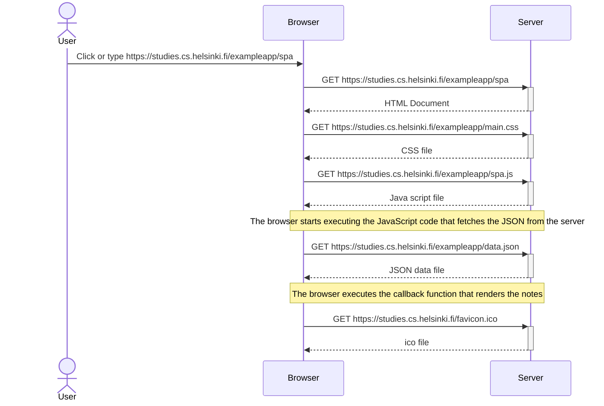

Create a diagram depicting the situation where the user goes to the [single-page app](https://fullstackopen.com/en/part0/fundamentals_of_web_apps#single-page-app) version of the notes app at https://studies.cs.helsinki.fi/exampleapp/spa
  
